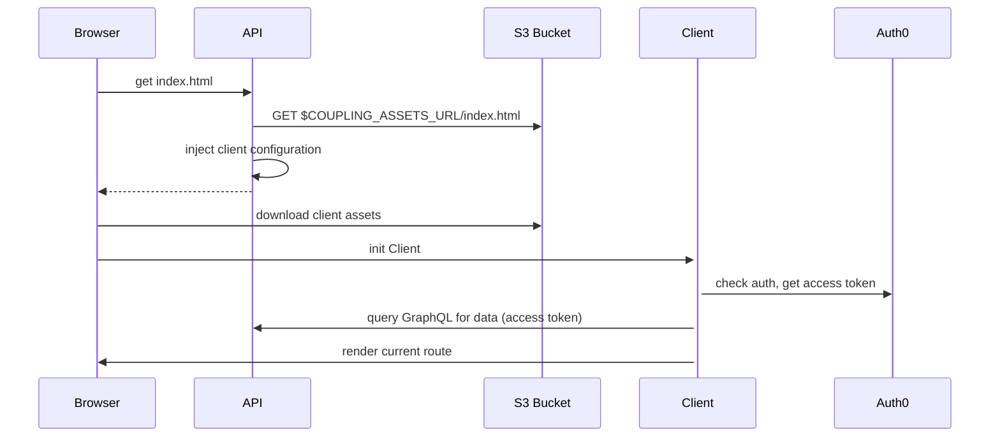

# Architecture

## Typical Loading Sequence

```mermaid

sequenceDiagram
    participant Browser
    participant API
    participant S3 Bucket
    participant Client
    Browser->>API: get index.html
    API->> S3 Bucket: GET $COUPLING_ASSETS_URL/index.html
    API->>API: inject client configuration
    API-->>Browser: 
    Browser->> S3 Bucket: download client assets
    Browser->>+Client: init Client
    Client->>Auth0: check auth, get access token
    Client->>API: query GraphQL for data (access token)
    Client->>Browser: render current route
    
```
